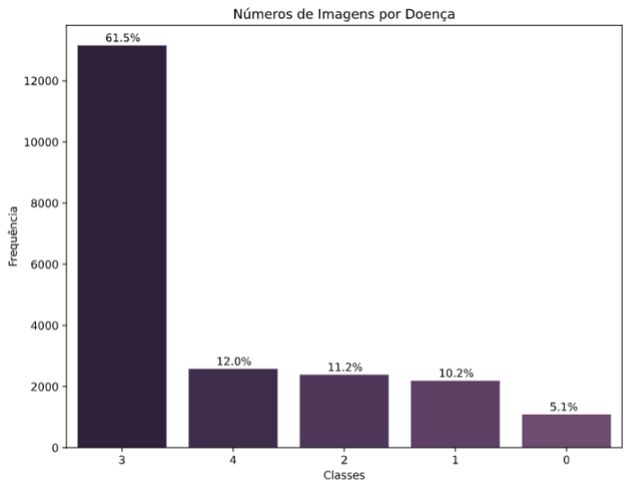
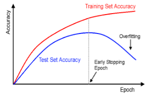

    

# Especialização em Ciência de Dados e Analytics

## Resumo

Como o segundo maior fornecedor de carboidratos na África, a mandioca é uma cultura de segurança alimentar essencial cultivada por pequenos agricultores porque pode suportar condições adversas. Pelo menos 80% das fazendas familiares na África Subsaariana cultivam essa raiz amilácea, mas as doenças virais são as principais fontes de baixa produção. Os métodos existentes de detecção de doenças exigem que os agricultores solicitem a ajuda de especialistas agrícolas financiados pelo governo para inspecionar visualmente e diagnosticar as plantas. Isso sofre por ser muito trabalhoso, com baixo suprimento e caro. Diante disso, esta pesquisa tem como finalidade a construção de uma máquina preditiva, usando Redes Neurais Profundas (CNN) será possível realizar a identificação do patógeno acometido nas folhas da Mandioca. Para guiar nossa pesquisa foi utilizada a metodologia SEMMA. Os resultados obtidos com o algoritmo construído foram satisfatórios chegando ao resultado de 91% de assertividades nos diagnósticos dos patógenos.

## Dados

* O Banco de imagens utilizado é da National Crops Resources Research Institute (NaCRRI) em colaboração com o laboratório de IA da Makerere University, Kampala. Nele temos um total de 21397 imagens divididas da seguinte forma:

    * Classe 0 - CBB
    * Classe 1 - CBSD
    * Classe 2 - CGM
    * Classe 3 - CMD
    * Classe 4 – Folha Saudável

    

Como podemos observar a classe 3 apresenta uma quantidade considerável em relação as demais, o desbalanceamento faz o modelo aprender mais sobre a classe predominante em relação as outras, esse tipo de problema é conhecido como classe rara. Para o problema da classe rara temos uma possível solução através da estratificação. Para realizar esse processo dados foram separados utilizando a técnica HoldOut de forma estratificada pela classe, mantendo suas proporções em cada separação; 70% (14977 para treino), 30% (6420 para teste), das imagens de treino 10% (642 para validação). Os dados de validação são usados ao final, com a intensão de simular um ambiente real de produção.

## Modelo

Algumas informações de técnicas utilizadas na criação da Rede Neural Convolucional.

  * **Transfer Learning**
 
    * O bjetivo da transferência de aprendizagem é melhorar a aprendizagem na tarefa alvo, aproveitando o conhecimento da tarefa de origem. Existem três medidas comuns pelas quais a transferência pode melhorar a aprendizagem. O primeiro é o desempenho inicial alcançável na tarefa alvo usando apenas o conhecimento transferido, antes que qualquer aprendizado adicional seja feito, em comparação com o desempenho inicial de um agente ignorante. O segundo é a quantidade de tempo que leva para aprender totalmente a tarefa alvo, dado o conhecimento transferido, em comparação com a quantidade de tempo para aprendê-la do zero. O terceiro é o nível de desempenho final alcançável na tarefa alvo em comparação com o nível final sem transferência.

  * **Data Augumentation**

    * hhh
  
  
  * **Hiperparâmetros**

    * ModelCheckpoint – Ao fim de cada epoch a função vai verificar o valor da val_loss, e comparar, salvando o modelo e seus pesos sempre que obtiver o menor valor para val_loss.
    * ReduceLROnPlateau – Checa o valor da val_loss ao final de cada epoch, se a mesma por duas epochs estagnar, irá reduzir a taxa de aprendizagem (learning rate).
    * EarlyStopping – Irá parar o treinamento se o valor da val_loss parar de diminuir por três epochs, entendendo que o modelo chegou em seu melhor ajuste, evitando assim o overfitting, na Figura 6 podemos verificar e entender melhor o funcionamento do EarlyStopping. 

    

## Avaliação

## Referências
